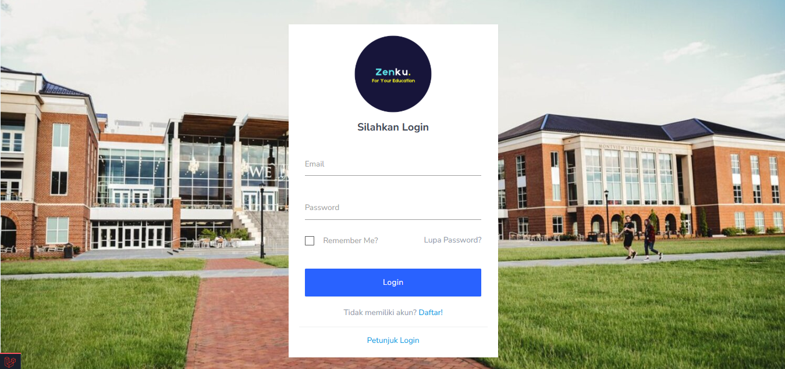
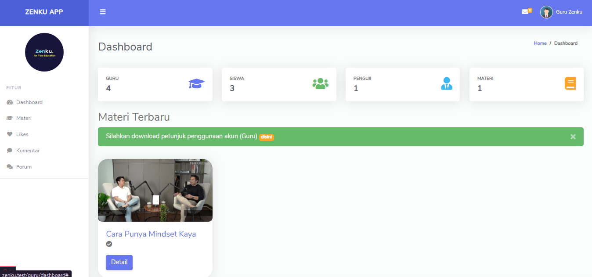
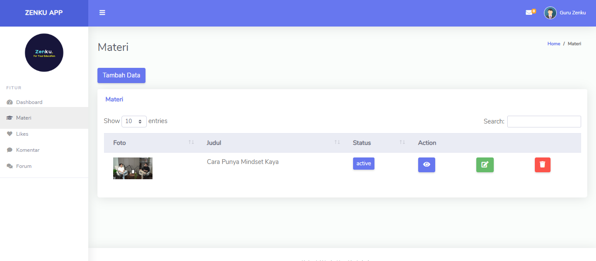
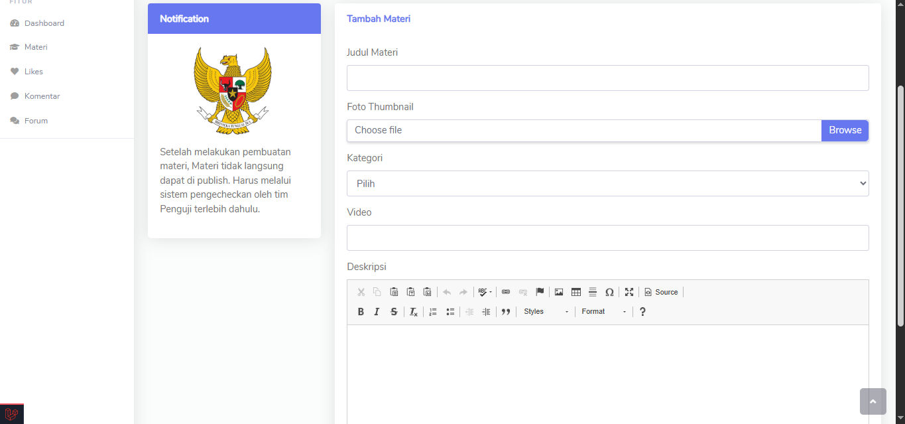
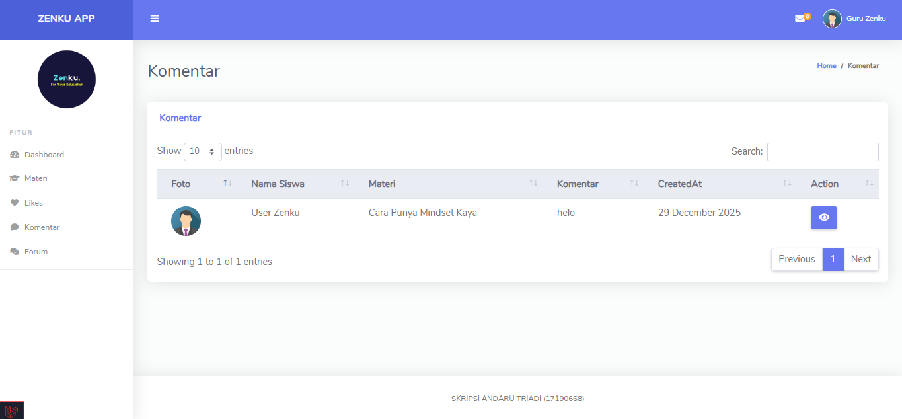
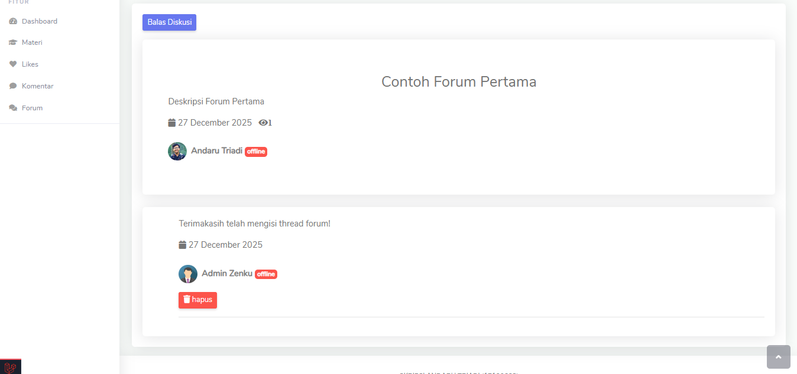
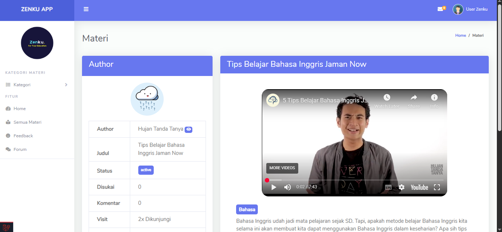
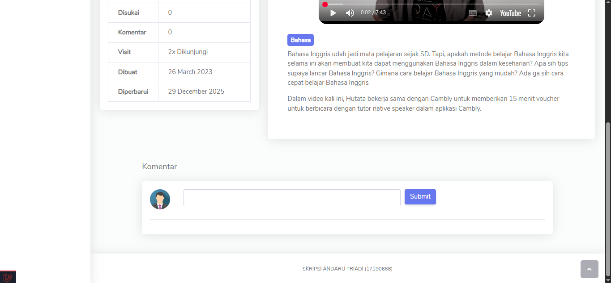

# ZENKU
Zenku adalah website sosial media pembelajaran yang dibuat untuk mempermudah siswa dalam mengulas materi yang telah diajarkan oleh guru sebelumnya. Aplikasi ini memiliki fitur seperti sosial media pada umumnya : like dan comment. Selain itu penulis memberikan fitur tambahan seperti forum diskusi antar guru dengan siswa. Dibuat Menggunakan Bootstrap, Laravel dan MySQL.

## Stack

    
    
    

## ERD

## Flowchart

<ul>
    <li>Guru upload video di youtube atau webstreaming lainnya.</li>
    <li>Guru buat materi dan menunggu materi nya harus di approval oleh penguji dulu.</li>
    <li>Penguji berhak melakukan reject apabila materi tidak sesuai dengan pedoman.</li>
    <li>Penguji melakukan approve materi.</li>
    <li>User dapat melihat materi yang telah di upload oleh guru.</li>
    <li>User dapat memberikan komentar.</li>
    <li>User dapat memberikan like.</li>
    <li>User dapat secara pribadi melakukan chat dengan guru.</li>
    <li>Admin memiliki full access seperti manage kategori, materi, likes, role access, komentar, aktifitas, menu, feedback dan akun.</li>
</ul>

## Role 
<ol>
    <li>Guru</li>
    <li>Penguji</li>
    <li>User</li>
    <li>Admin</li>
</ol>

## Account
### Admin
- Email: admin@zenku.com
- Password: zenku123

### Guru
- Email: guru@zenku.com
- Password: zenku123

### Penguji
- Email: penguji@zenku.com
- Password: zenku123

### User
- Email: andarutr@zenku.com
- Password: zenku123

## Config
Catatan sebelum menggunakan Zenku buat database dengan nama **zenku** dan ketik perintah berikut pada terminal kamu :
 - `composer install`
 - `cp .env.example .env`
 - `php artisan key:generate`
 - `php artisan migrate`
 - `php artisan db:seed`

 ## Plugin / Libraries
- Axios
- Sweetalert2
- Toastr.js
- Fontawesome

 ## Feature
- Create Materi Pelajaran
- Approval Materi Pelajaran
- Management Likes
- Management Comment
- Forum
- Personal Chat
- Management Feedback
- Pantau Activity
- Management Menu
- Management Role Access

 ## Screenshot

